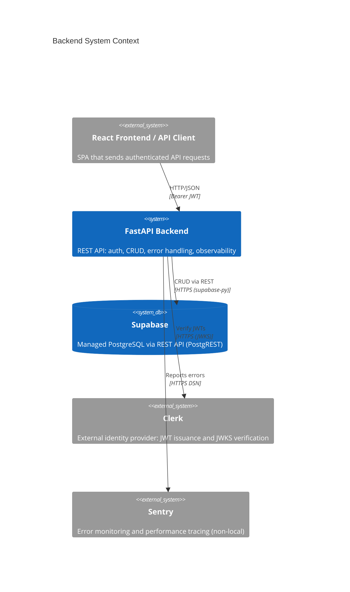
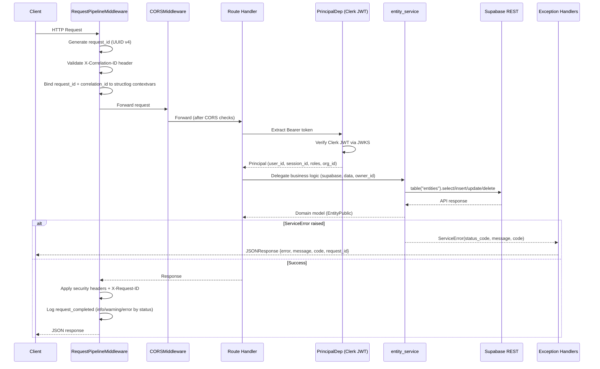
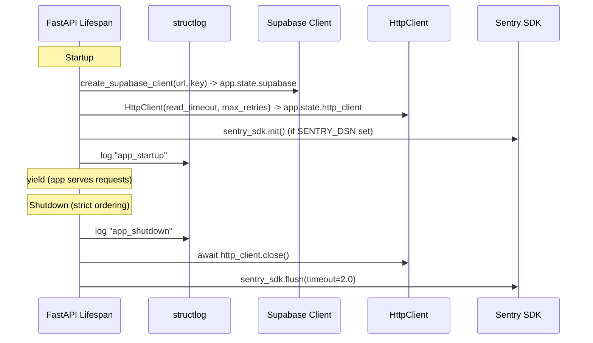
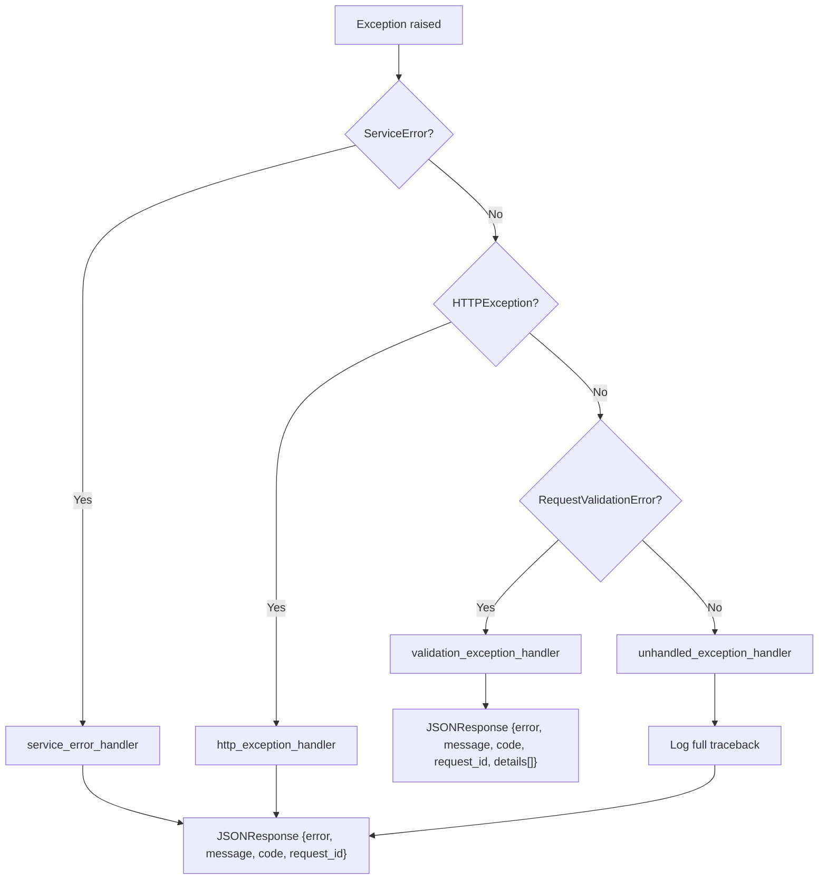

# Backend Architecture Overview

## Purpose

The backend is a Python/FastAPI REST API that provides authenticated, owner-scoped CRUD operations for domain entities via Supabase REST (managed PostgreSQL). It validates Clerk-issued JWTs for authentication, enforces per-user data isolation through ownership scoping, and exposes a versioned API under `/api/v1` with operational health endpoints at root level. The backend produces a structured OpenAPI schema consumed by the frontend's auto-generated API client, and is designed as a single-service building block within a gateway-ready microservice architecture.

## System Context



## Key Components

| Component | Purpose | Technology | Location |
|-----------|---------|------------|----------|
| App Entry & Lifespan | FastAPI app creation, async lifespan for startup/shutdown of shared resources (Supabase, HttpClient, Sentry), middleware and router registration | FastAPI, Python asynccontextmanager | `backend/app/main.py` |
| API Router | Mounts versioned route modules under `/api/v1` | FastAPI APIRouter | `backend/app/api/main.py` |
| Entity Routes | Thin CRUD handlers that inject auth + DB dependencies, delegate to service layer | FastAPI APIRouter | `backend/app/api/routes/entities.py` |
| Health Routes | `/healthz` (liveness), `/readyz` (Supabase connectivity), `/version` (build metadata) -- public, no auth | FastAPI APIRouter | `backend/app/api/routes/health.py` |
| Dependency Declarations | Typed `Annotated[T, Depends(...)]` aliases: `SupabaseDep`, `PrincipalDep`, `HttpClientDep`, `RequestIdDep` | FastAPI Depends | `backend/app/api/deps.py` |
| Clerk Auth | Validates Clerk JWT Bearer tokens via SDK; extracts `Principal` identity; maps auth failures to `AUTH_*` error codes | clerk-backend-api, httpx | `backend/app/core/auth.py` |
| Configuration | Pydantic Settings: required secrets (`SUPABASE_URL`, `SUPABASE_SERVICE_KEY`, `CLERK_SECRET_KEY`), environment-based defaults, CORS parsing, secret enforcement validator | pydantic-settings | `backend/app/core/config.py` |
| Error Handling | `ServiceError` exception, `STATUS_CODE_MAP`, 4 global handlers (ServiceError, HTTPException, ValidationError, catch-all) | FastAPI exception handlers | `backend/app/core/errors.py` |
| HTTP Client | Shared async client with retry (exponential backoff on 502/503/504), circuit breaker (5 failures / 60s window), X-Request-ID/X-Correlation-ID propagation | httpx, structlog | `backend/app/core/http_client.py` |
| Structured Logging | JSON (production) or console (local) renderer; service metadata injection; contextvars-based request-scoped fields | structlog >=24.1.0 | `backend/app/core/logging.py` |
| Request Pipeline Middleware | Outermost middleware: UUID v4 request_id, correlation ID propagation with validation, security headers, HSTS (production), status-level logging | Starlette BaseHTTPMiddleware | `backend/app/core/middleware.py` |
| Supabase Client | Factory function + FastAPI dependency; created at startup, stored on `app.state` | supabase-py | `backend/app/core/supabase.py` |
| Entity Service | Module-level CRUD functions accepting `supabase.Client`; owner-scoped queries; `ServiceError` propagation with `ENTITY_*` codes | Python, supabase-py, postgrest-py | `backend/app/services/entity_service.py` |
| Pydantic Models | `ErrorResponse`, `ValidationErrorResponse`, `PaginatedResponse[T]`, `Principal`, `EntityCreate/Update/Public`, `EntitiesPublic` | Pydantic 2.x | `backend/app/models/` |

## Server-Side Data Flow

### Request Processing Pipeline



### Application Lifespan



## Service Architecture

| Service | Responsibility | Dependencies |
|---------|---------------|--------------|
| `entity_service` | Owner-scoped entity CRUD: create, get, list (paginated, max 100), update (partial, no-op short-circuit), delete. All operations enforce `owner_id` filtering. | `supabase.Client`, `app.models.entity.*`, `app.core.errors.ServiceError` |

## Dependency Injection

The backend uses FastAPI's `Depends()` system with typed `Annotated` aliases declared in `backend/app/api/deps.py`. Route handlers declare dependencies via parameter type annotations; FastAPI resolves the dependency chain automatically. All dependencies are overridable in tests via `app.dependency_overrides`.

| Type Alias | Resolves To | Resolver Function | Source |
|------------|-------------|-------------------|--------|
| `SupabaseDep` | `supabase.Client` | `get_supabase(request)` | `app.state.supabase` (set during lifespan startup) |
| `PrincipalDep` | `Principal` | `get_current_principal(request)` | Clerk JWT validation via SDK |
| `HttpClientDep` | `HttpClient` | `get_http_client(request)` | `app.state.http_client` (set during lifespan startup) |
| `RequestIdDep` | `str` | `get_request_id(request)` | `request.state.request_id` (set by middleware) |

## API Endpoints

| Method | Path | Auth | Description |
|--------|------|------|-------------|
| `POST` | `/api/v1/entities/` | Yes | Create a new entity owned by the authenticated user |
| `GET` | `/api/v1/entities/` | Yes | List entities with pagination (`offset`, `limit`) |
| `GET` | `/api/v1/entities/{entity_id}` | Yes | Retrieve a single entity by ID |
| `PATCH` | `/api/v1/entities/{entity_id}` | Yes | Partially update an entity |
| `DELETE` | `/api/v1/entities/{entity_id}` | Yes | Delete an entity (returns 204) |
| `GET` | `/healthz` | No | Liveness probe (returns 200 immediately) |
| `GET` | `/readyz` | No | Readiness probe (checks Supabase connectivity) |
| `GET` | `/version` | No | Build metadata (service_name, version, commit, build_time, environment) |

## Error Handling

All API errors are routed through a unified exception handling framework that guarantees every error response conforms to a standard JSON envelope.

### Error Response Shape

```json
{
  "error": "NOT_FOUND",
  "message": "Entity not found",
  "code": "ENTITY_NOT_FOUND",
  "request_id": "550e8400-e29b-41d4-a716-446655440000"
}
```

For validation errors (HTTP 422), the response extends with field-level details:

```json
{
  "error": "VALIDATION_ERROR",
  "message": "Request validation failed.",
  "code": "VALIDATION_FAILED",
  "request_id": "...",
  "details": [
    { "field": "title", "message": "Field required", "type": "missing" }
  ]
}
```

### Exception Handler Chain



### Error Response Models

| Model | Fields | Usage |
|-------|--------|-------|
| `ErrorResponse` | `error`, `message`, `code`, `request_id` | Standard envelope for all non-validation errors |
| `ValidationErrorDetail` | `field`, `message`, `type` | Single field-level validation failure |
| `ValidationErrorResponse` | Extends `ErrorResponse` + `details: list[ValidationErrorDetail]` | HTTP 422 validation errors |

## Middleware Stack

`RequestPipelineMiddleware` is registered as the **outermost** ASGI middleware (added last via `app.add_middleware()` -- Starlette last-added = outermost). This ensures security headers and `X-Request-ID` are set on **all** responses, including CORS preflight OPTIONS responses.

```
Request
  +-- RequestPipelineMiddleware (outermost)
        +-- CORSMiddleware
              +-- FastAPI / Route Handlers
```

### Request Lifecycle (per request)

1. Generate `request_id` (UUID v4)
2. Read `X-Correlation-ID` header; validate against `^[a-zA-Z0-9\-_.]{1,128}$`; fall back to `request_id` if absent or invalid
3. Store `request_id` and `correlation_id` in `request.state`
4. Bind both to structlog contextvars (automatically present in all log lines)
5. Process request via `call_next`; catch unhandled exceptions and return 500 JSON
6. Calculate `duration_ms`
7. Apply security headers (6 standard + HSTS in production)
8. Set `X-Request-ID` response header
9. Log `request_completed` at status-appropriate level (2xx=info, 4xx=warning, 5xx=error)
10. Clear contextvars to prevent leakage

### Security Headers

| Header | Value | Condition |
|--------|-------|-----------|
| Content-Security-Policy | `default-src 'self'; script-src 'self'; style-src 'self' 'unsafe-inline'; img-src 'self' data:; font-src 'self' data:; connect-src 'self' https://*.supabase.co https://*.clerk.accounts.dev; object-src 'none'; base-uri 'self'; form-action 'self'; frame-ancestors 'none'` | All responses |
| X-Content-Type-Options | nosniff | All responses |
| X-Frame-Options | DENY | All responses |
| X-XSS-Protection | 0 (disabled, CSP preferred) | All responses |
| Referrer-Policy | strict-origin-when-cross-origin | All responses |
| Permissions-Policy | camera=(), microphone=(), geolocation=() | All responses |
| Strict-Transport-Security | max-age=31536000; includeSubDomains | Production only |

## Structured Logging

`setup_logging(settings)` is called once at module load in `main.py` before app creation.

**Processor chain (in order):**

1. `merge_contextvars` -- merges request-scoped fields bound by middleware
2. `add_log_level` -- adds `level` field
3. `TimeStamper(fmt="iso")` -- adds ISO 8601 `timestamp` field
4. `_add_service_info` -- injects `service`, `version`, `environment` via `setdefault`
5. `StackInfoRenderer` -- renders stack info if present
6. `format_exc_info` -- formats exception info
7. `UnicodeDecoder` -- decodes bytes to strings
8. Renderer: `JSONRenderer` (LOG_FORMAT=json) or `ConsoleRenderer` (LOG_FORMAT=console)

**Request log fields** (event: `request_completed`):
- Always: `timestamp`, `level`, `event`, `service`, `version`, `environment`, `request_id`, `correlation_id`, `method`, `path`, `status_code`, `duration_ms`
- Optional: `user_id` (when `request.state.user_id` is set by auth)

## Configuration

Settings are managed via `pydantic-settings` (`backend/app/core/config.py`), loading from environment variables with `.env` file fallback.

### Required Settings (no defaults)

| Setting | Type | Description |
|---------|------|-------------|
| `SUPABASE_URL` | `AnyUrl` | Supabase project URL |
| `SUPABASE_SERVICE_KEY` | `SecretStr` | Supabase service role key |
| `CLERK_SECRET_KEY` | `SecretStr` | Clerk backend secret key |

### Optional Settings (with defaults)

| Setting | Type | Default | Description |
|---------|------|---------|-------------|
| `ENVIRONMENT` | `local/staging/production` | `local` | Deployment environment |
| `SERVICE_NAME` | `str` | `my-service` | Service identifier for logging |
| `SERVICE_VERSION` | `str` | `0.1.0` | Semantic version for logging |
| `LOG_LEVEL` | `DEBUG/INFO/WARNING/ERROR` | `INFO` | Minimum log level |
| `LOG_FORMAT` | `json/console` | `json` | Log output format |
| `API_V1_STR` | `str` | `/api/v1` | API version prefix |
| `BACKEND_CORS_ORIGINS` | `list[str]` | `[]` | Allowed CORS origins |
| `CLERK_JWKS_URL` | `str \| None` | `None` | Custom Clerk JWKS endpoint |
| `CLERK_AUTHORIZED_PARTIES` | `list[str]` | `[]` | JWT authorized parties |
| `HTTP_CLIENT_TIMEOUT` | `int` | `30` | HTTP client read timeout (seconds) |
| `HTTP_CLIENT_MAX_RETRIES` | `int` | `3` | HTTP client max retry attempts |
| `SENTRY_DSN` | `str \| None` | `None` | Sentry DSN (enables error reporting) |

### Secret Enforcement

`Settings._check_default_secret()` validates that `SUPABASE_SERVICE_KEY` and `CLERK_SECRET_KEY` are not left as the default `"changethis"` value. In `local` environment this produces a warning; in `staging` or `production` it raises `ValueError`, preventing startup with weak credentials. Additionally, wildcard CORS origins (`"*"`) are rejected in production.

## Service-to-Service Communication

When this service needs to call another internal service, it uses the shared `HttpClient` instance stored on `app.state.http_client`. The client automatically propagates `X-Request-ID` and `X-Correlation-ID` headers from structlog contextvars, maintaining traceable correlation across service boundaries.

**Service discovery:** Each upstream dependency is declared via a `{SERVICE_NAME}_URL` environment variable pointing to an internal DNS name (e.g., `USER_SERVICE_URL=https://user-service.railway.internal`).

**SSRF prevention:** `{SERVICE_NAME}_URL` values must always point to trusted internal endpoints and must never be set from user-supplied input.

## Architecture Decisions

| ADR | Title | Status | Date |
|-----|-------|--------|------|
| — | No decisions recorded yet | — | — |

## Known Constraints

1. **Supabase-managed database** -- All data storage uses Supabase (managed PostgreSQL via REST API). There is no local PostgreSQL instance. This introduces a runtime dependency on the Supabase service and network latency for all database operations.

2. **Stateless JWT with no revocation** -- Access tokens cannot be individually revoked by the microservice. Revocation is the responsibility of Clerk as the external identity provider.

3. **Monorepo coupling** -- Backend and frontend share a single repository and Docker Compose deployment. Both must be deployed together and share the same release cadence.

4. **Default secrets in local development** -- `SUPABASE_SERVICE_KEY` and `CLERK_SECRET_KEY` are validated on startup. The `Settings` validator warns in local mode but raises `ValueError` in staging/production.

5. **Middleware ordering sensitivity** -- `RequestPipelineMiddleware` must remain the last `add_middleware()` call in `main.py` to stay outermost. Adding new middleware after it will cause security headers and X-Request-ID to be absent on responses short-circuited by the new middleware.

6. **Conditional test fixtures** -- `backend/tests/conftest.py` guards integration-level fixtures behind a `try/except` import block (`_INTEGRATION_DEPS_AVAILABLE`), allowing unit tests to run without the full app context.

7. **Clerk-only authentication** -- All authentication is delegated to Clerk. There is no internal password hashing, token generation, or user management.

## Related Documents

- [Frontend Architecture](./frontend-overview.md)
- [Data Models](../data/models.md)
- [API Documentation](../api/overview.md)
- [Deployment Guide](../deployment/environments.md)
- [Testing Strategy](../testing/strategy.md)
