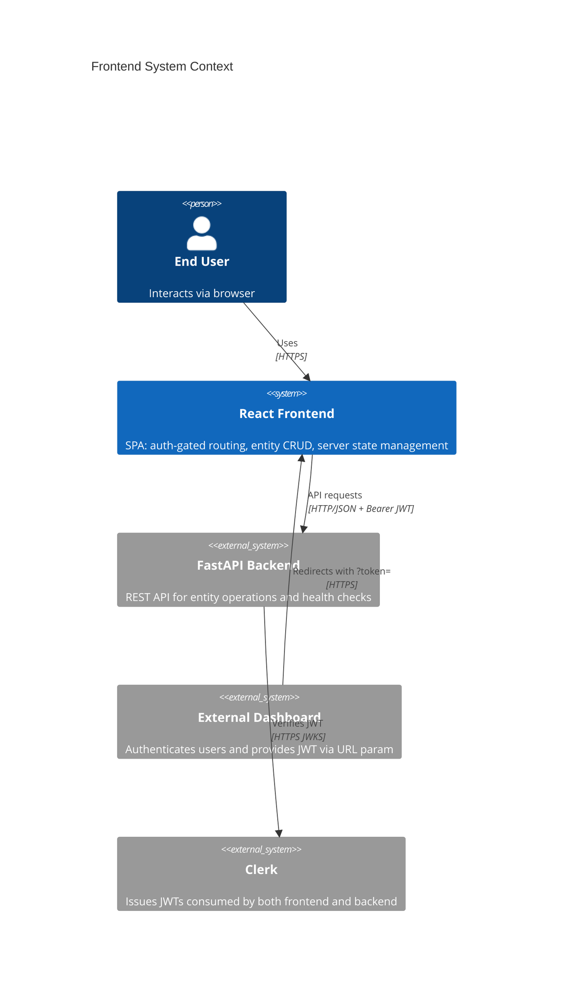
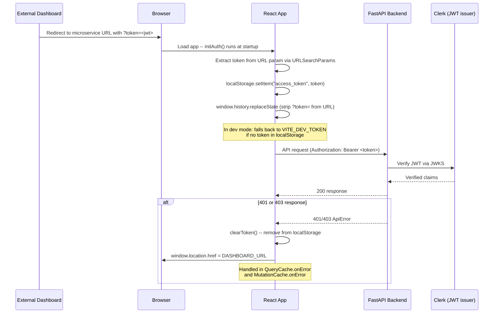
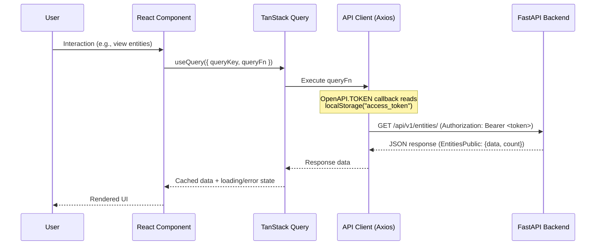
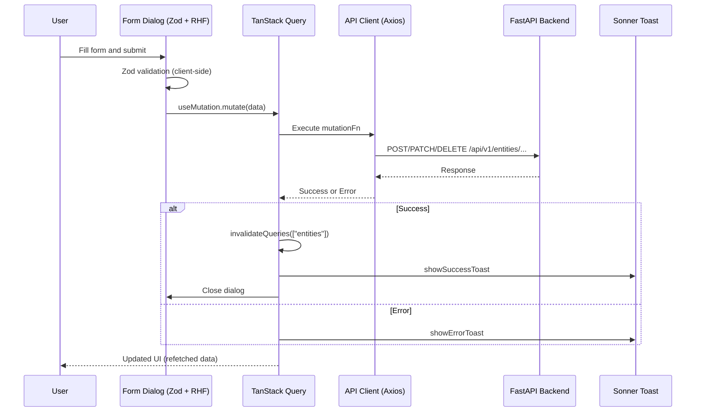
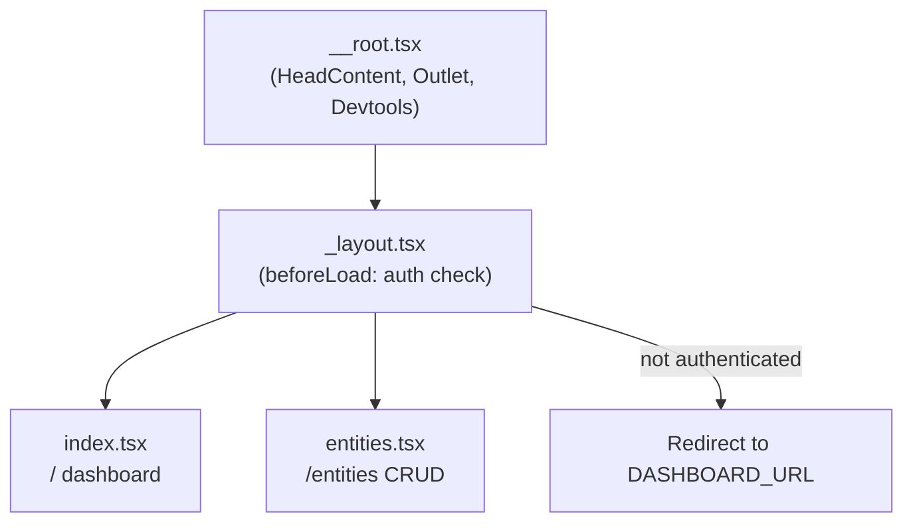

# Frontend Architecture Overview

## Purpose

The frontend is a React single-page application that provides an authenticated UI for managing domain entities. It has no login, signup, or password-recovery pages -- authentication is fully delegated to an external dashboard that passes a Clerk JWT token via URL parameter. The app renders a sidebar-based layout with entity CRUD (create, read, update, delete) powered by auto-generated API client bindings and TanStack Query for server state management. It serves as a reference implementation for building additional resource views in the microservice template.

## System Context



## Key Components

| Component | Purpose | Technology | Location |
|-----------|---------|------------|----------|
| App Entry | React root, QueryClient setup, OpenAPI config, auth initialization, theme + toast providers | React 19.1, TanStack Query, Vite | `frontend/src/main.tsx` |
| Root Route | Root layout with devtools, error boundary, and not-found handler | TanStack Router | `frontend/src/routes/__root.tsx` |
| Auth Layout | Auth-gated layout wrapper: checks `localStorage` for token, redirects to `DASHBOARD_URL` if missing; renders sidebar + main content + footer | TanStack Router | `frontend/src/routes/_layout.tsx` |
| Home Page | Dashboard landing page (index route) | React | `frontend/src/routes/_layout/index.tsx` |
| Entities Page | Entity list with CRUD operations | React, TanStack Table | `frontend/src/routes/_layout/entities.tsx` |
| AddEntity | Create entity dialog with Zod validation + React Hook Form + useMutation | React, Zod, RHF, TanStack Query | `frontend/src/components/Entities/AddEntity.tsx` |
| EditEntity | Update entity dialog (partial update) | React, Zod, RHF, TanStack Query | `frontend/src/components/Entities/EditEntity.tsx` |
| DeleteEntity | Delete confirmation dialog | React, TanStack Query | `frontend/src/components/Entities/DeleteEntity.tsx` |
| EntityActionsMenu | Row-level actions dropdown (edit, delete) | React, shadcn/ui | `frontend/src/components/Entities/EntityActionsMenu.tsx` |
| Entity Columns | TanStack Table column definitions | TanStack Table | `frontend/src/components/Entities/columns.tsx` |
| DataTable | Reusable paginated table component | TanStack Table | `frontend/src/components/Common/DataTable.tsx` |
| AppSidebar | Navigation sidebar with route items (Dashboard, Entities) | React, shadcn/ui | `frontend/src/components/Sidebar/AppSidebar.tsx` |
| User Menu | User avatar and sign-out action | React, shadcn/ui | `frontend/src/components/Sidebar/User.tsx` |
| ThemeProvider | Dark/light/system theme context with localStorage persistence | React Context | `frontend/src/components/theme-provider.tsx` |
| useAuth | Token management: `initAuth`, `getToken`, `setToken`, `clearToken`, `isAuthenticated` | localStorage, URLSearchParams | `frontend/src/hooks/useAuth.ts` |
| useCustomToast | Success/error toast wrappers | sonner | `frontend/src/hooks/useCustomToast.ts` |
| useCopyToClipboard | Clipboard copy with auto-reset | Clipboard API | `frontend/src/hooks/useCopyToClipboard.ts` |
| useMobile | Responsive breakpoint detection (768px) | matchMedia | `frontend/src/hooks/useMobile.ts` |
| API Client | Auto-generated type-safe HTTP client from backend OpenAPI schema | @hey-api/openapi-ts, Axios 1.13 | `frontend/src/client/` (DO NOT EDIT) |
| UI Primitives | shadcn/ui component library (new-york variant) | Tailwind CSS 4.2, Radix UI | `frontend/src/components/ui/` (DO NOT EDIT) |

## Client-Side Data Flow

### Authentication Flow

Authentication is fully delegated to an external dashboard. The frontend has no login, signup, or password-recovery pages.



### API Request Data Flow



### Mutation Data Flow



## State Management

| Store/Context | Purpose | Scope | Persistence |
|---------------|---------|-------|-------------|
| TanStack Query (`QueryClient`) | Server state: entity data, caching, background refetching, global 401/403 error interception | Global | In-memory cache |
| TanStack Router | URL-driven route state, file-based routing with auth guard | Global | URL |
| ThemeProvider (React Context) | Dark/light/system theme selection and resolution | Global | `localStorage` (`vite-ui-theme`) |
| Auth (imperative functions) | JWT token storage and retrieval -- no React state or context | Global | `localStorage` (`access_token`) |
| React Hook Form | Form field values, validation state, submission state | Per-dialog | Component lifecycle |
| TanStack Table | Table sorting, pagination, column visibility | Per-component | Component lifecycle |

## Routing Structure

All routes require authentication. There are no public routes -- unauthenticated users are redirected to the external `DASHBOARD_URL`.

```
frontend/src/routes/
  __root.tsx              Root layout (devtools, error/notFound components)
  _layout.tsx             Auth-gated layout (sidebar + main + footer)
  _layout/
    index.tsx             / (dashboard home page)
    entities.tsx          /entities (entity CRUD with DataTable)
```

### Route Component Tree



## Component Organization

```
frontend/src/
  components/
    Common/              Infrastructure components shared across features
      Appearance.tsx       Theme toggle (dark/light/system)
      DataTable.tsx        Paginated table (TanStack Table) -- reusable for any resource
      ErrorComponent.tsx   Error boundary fallback
      Footer.tsx           App footer
      Logo.tsx             App logo (responsive for sidebar)
      NotFound.tsx         404 page
    Entities/            Reference CRUD implementation (canonical pattern)
      AddEntity.tsx        Create dialog (Zod + RHF + useMutation)
      EditEntity.tsx       Update dialog (partial update)
      DeleteEntity.tsx     Delete confirmation dialog
      EntityActionsMenu.tsx  Row actions dropdown
      columns.tsx          TanStack Table column definitions
    Pending/             Loading skeletons for Suspense boundaries
    Sidebar/             Navigation chrome
      AppSidebar.tsx       Nav items array -- add new routes here
      Main.tsx             Nav item renderer
      User.tsx             User avatar + sign out
    ui/                  shadcn/ui primitives (auto-generated, DO NOT EDIT)
    theme-provider.tsx   Theme context (dark mode default, localStorage)
  hooks/
    useAuth.ts             Token management (initAuth, getToken, setToken, clearToken)
    useCustomToast.ts      Success/error toast wrappers (sonner)
    useCopyToClipboard.ts  Clipboard with auto-reset
    useMobile.ts           Responsive breakpoint detection (768px)
  routes/                TanStack Router file-based routes
  client/                Auto-generated API client (DO NOT EDIT)
```

## API Client

The client is auto-generated from the backend's OpenAPI schema at `/api/v1/openapi.json` using `@hey-api/openapi-ts`. Output is written to `frontend/src/client/` and must not be manually edited.

**Configuration** (in `main.tsx`):
- `OpenAPI.BASE` is set from `VITE_API_URL` environment variable
- `OpenAPI.TOKEN` is an async callback that reads the JWT from `localStorage`

**Transport:** Axios 1.13

**Regeneration:** `bash ./scripts/generate-client.sh` (also triggered by pre-commit hook on backend changes)

**Available service classes:**
- `EntitiesService` -- CRUD operations for entities
- `OperationsService` -- Health and version endpoints

### Usage Pattern

```tsx
import { EntitiesService } from "@/client"

// Reads: useQuery or useSuspenseQuery
const { data } = useQuery({
  queryKey: ["entities"],
  queryFn: () => EntitiesService.readEntities({ skip: 0, limit: 100 }),
})

// Writes: useMutation with cache invalidation
const mutation = useMutation({
  mutationFn: (data: EntityCreate) =>
    EntitiesService.createEntity({ requestBody: data }),
  onSettled: () => queryClient.invalidateQueries({ queryKey: ["entities"] }),
})
```

**Query key conventions:** Use the resource name as the base key (e.g., `["entities"]` for lists, `["entities", id]` for individual items).

## How to Add a New Route

1. Create a route file at `frontend/src/routes/_layout/<resource>.tsx`
2. TanStack Router auto-generates the route tree (`routeTree.gen.ts`) on next dev server restart
3. Add a navigation item to the `items` array in `frontend/src/components/Sidebar/AppSidebar.tsx`:
   ```tsx
   { icon: YourIcon, title: "Resources", path: "/resources" }
   ```
4. The `_layout.tsx` auth guard automatically protects the new route

## How to Add a CRUD Form

Follow the `AddEntity.tsx` pattern:

1. **Zod schema** -- Define validation rules (`z.object({ title: z.string().min(1), ... })`)
2. **useForm** -- `useForm<FormData>({ resolver: zodResolver(schema), mode: "onBlur" })`
3. **useMutation** -- Call the auto-generated service function, wire `onSuccess`/`onError`/`onSettled`
4. **Dialog** -- shadcn `Dialog` with controlled `open` state and `FormField` components
5. **Invalidate queries** -- `queryClient.invalidateQueries({ queryKey: ["<resource>"] })` in `onSettled`
6. **Toast feedback** -- `useCustomToast()` for `showSuccessToast`/`showErrorToast`

## Testing Patterns

Tests use **Vitest** + **React Testing Library** with jsdom environment.

- **Hook tests** -- `renderHook()` with module mocks (`vi.mock(...)`)
- **Component tests** -- `render()` with `QueryClientProvider` wrapper, mock service modules
- **Interactions** -- `@testing-library/user-event` for realistic user events
- **Async assertions** -- `waitFor()` for mutation/query settlement
- **Mock patterns** -- Mock `@/client` services, `@/hooks/useCustomToast`, and `window.matchMedia`
- **E2E tests** -- Playwright in `frontend/tests/` (entities CRUD lifecycle, navigation)
- **Auth in E2E** -- Token injection via `page.addInitScript()` (no login form)

## Architecture Decisions

| ADR | Title | Status | Date |
|-----|-------|--------|------|
| — | No decisions recorded yet | — | — |

## Known Constraints

1. **localStorage token storage** -- JWT tokens are stored in `localStorage`, which is accessible to any JavaScript running on the same origin. This trades security (compared to httpOnly cookies) for simplicity in the SPA architecture. XSS vulnerabilities would expose tokens. The token is injected by the external dashboard via `?token=` URL param and cleaned from the URL immediately after extraction.

2. **No internal auth pages** -- The frontend has no login, signup, or password-recovery pages. All authentication UI is handled by the external dashboard. If the dashboard URL is misconfigured, users will be redirected to a broken page on auth failure.

3. **Auto-generated API client (build-time dependency)** -- The frontend API client is generated from the backend's OpenAPI schema. Any backend API change requires regenerating the client (`scripts/generate-client.sh`) to maintain type safety. The pre-commit hook automates this, but it creates a build-time coupling between frontend and backend.

4. **Auto-generated files -- DO NOT EDIT** -- `frontend/src/client/` (OpenAPI client), `frontend/src/routeTree.gen.ts` (route tree), and `frontend/src/components/ui/` (shadcn/ui) are all auto-generated. Manual edits will be overwritten.

5. **Nginx CSP enforcement** -- The frontend Nginx configuration (`frontend/nginx.conf`) sets the same Content-Security-Policy as the backend middleware. If the policy is updated, it must be changed in **both** locations to maintain consistency.

6. **External redirect on auth failure** -- On 401/403 responses from the backend, the app clears the token and performs a full-page redirect to `DASHBOARD_URL` via `window.location.href`. This causes a complete app reload when the user returns.

## Related Documents

- [Backend Architecture](./backend-overview.md)
- [API Documentation](../api/overview.md)
- [Testing Strategy](../testing/strategy.md)
- [Data Models](../data/models.md)
