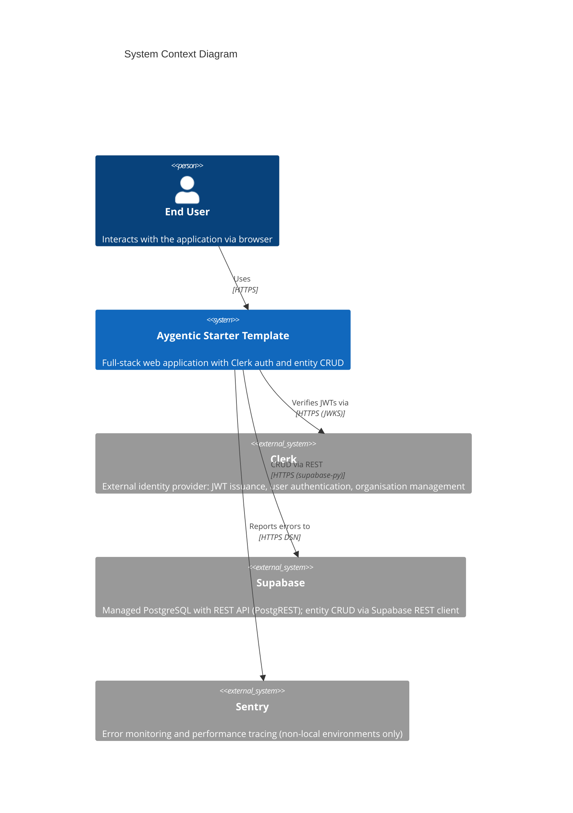
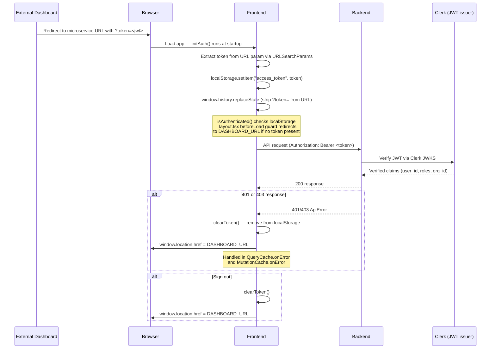
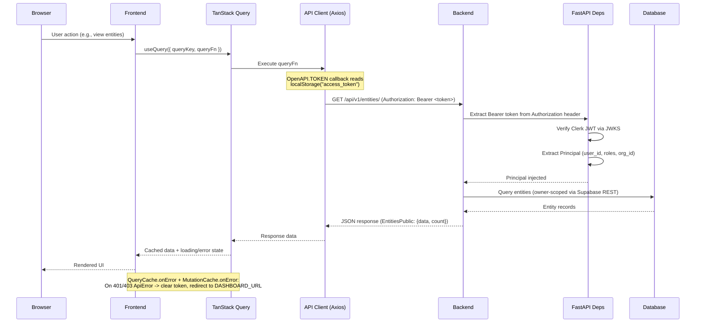
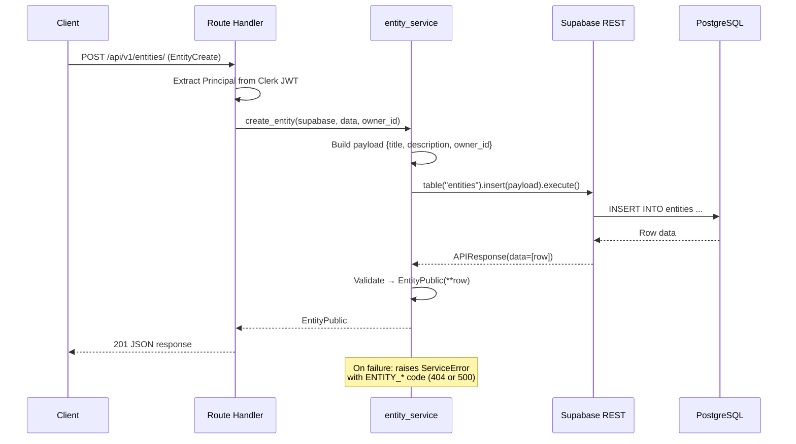
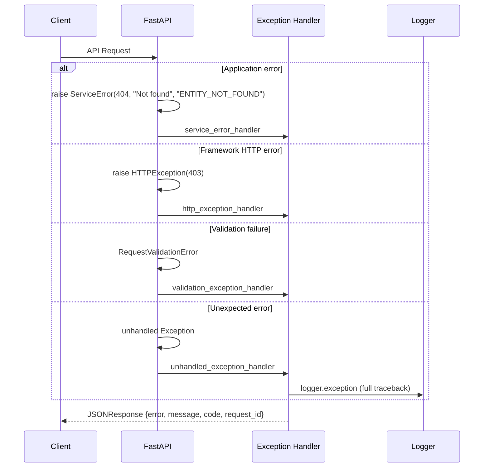
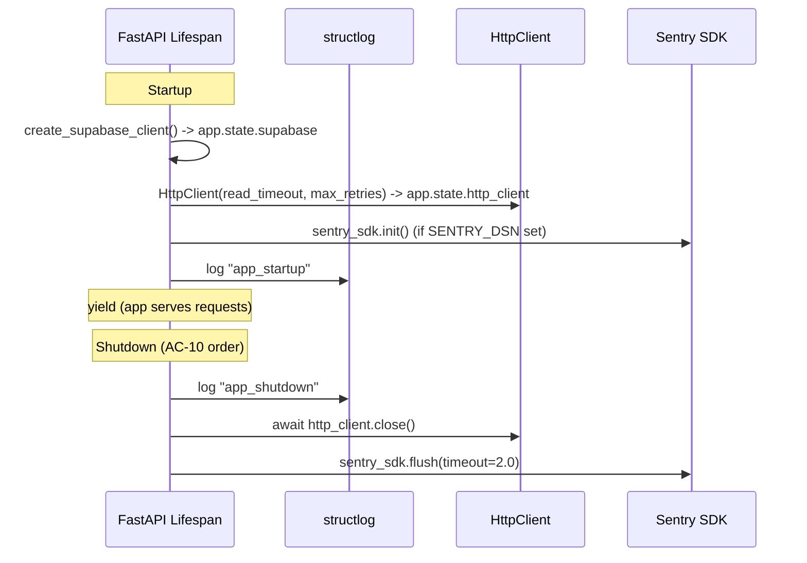

# Architecture Overview

## Purpose

The Aygentic Starter Template is a full-stack monorepo providing a production-ready foundation for building microservice web applications. It combines a Python/FastAPI REST API backend with a React/TypeScript single-page application frontend, using Supabase (managed PostgreSQL via REST API) for data storage, and deployed via Docker Compose with Traefik as a reverse proxy. Authentication is fully delegated to an external dashboard: users authenticate externally and are passed into the microservice via a JWT token in the `?token=` URL parameter. The system delivers Clerk JWT verification, owner-scoped CRUD operations for domain entities via a Supabase service layer, a unified error handling framework that guarantees consistent JSON error responses across all endpoints, and an auto-generated type-safe API client that bridges backend and frontend.

## System Context



## Key Components

| Component | Purpose | Technology | Location |
|-----------|---------|------------|----------|
| FastAPI Backend | REST API server (titled via `SERVICE_NAME` setting) handling auth, CRUD, and business logic; uses an async `lifespan` context manager to initialise shared resources (Supabase client, HttpClient, Sentry) on startup and clean them up on shutdown; registers unified error handlers at startup; initializes structured logging at startup via `setup_logging(settings)` and registers `RequestPipelineMiddleware` as the outermost middleware | Python 3.10+, FastAPI >=0.114.2, Pydantic 2.x | `backend/app/main.py` |
| API Router | Mounts versioned route modules under `/api/v1` | FastAPI APIRouter | `backend/app/api/main.py` |
| Clerk Auth Dependency | Validates Clerk JWT Bearer tokens using the Clerk SDK; extracts `Principal` identity (user_id, session_id, roles, org_id) from JWT claims; maps auth failures to structured `AUTH_*` error codes; sets `request.state.user_id` for logging middleware | clerk-backend-api, httpx | `backend/app/core/auth.py` |
| HTTP Client | Shared async HTTP client with configurable timeouts (5s connect / 30s read), automatic retry with exponential backoff (0.5s, 1.0s, 2.0s) on 502/503/504, circuit breaker (5 failures / 60s window), and X-Request-ID / X-Correlation-ID header propagation from structlog contextvars; created once during lifespan startup and stored on `app.state.http_client` | httpx, structlog | `backend/app/core/http_client.py` |
| Supabase Client Factory | Factory function `create_supabase_client()` initialises a Supabase Client from URL + service key; `get_supabase()` FastAPI dependency retrieves it from `app.state`; raises ServiceError 503 on initialisation failure or missing state | supabase-py | `backend/app/core/supabase.py` |
| Error Handling | Unified exception handler framework; `ServiceError` exception, `STATUS_CODE_MAP`, 4 global handlers registered at startup via `register_exception_handlers(app)` | FastAPI exception handlers, Pydantic response models | `backend/app/core/errors.py` |
| Structured Logging | Configures structlog with JSON (production/CI) or console (local) renderer; injects service metadata (service, version, environment) and request-scoped fields (request_id, correlation_id) via contextvars into every log entry | structlog >=24.1.0 | `backend/app/core/logging.py` |
| Request Pipeline Middleware | Outermost middleware: generates UUID v4 request_id, propagates X-Correlation-ID (with validation), binds both to structlog contextvars, sets five security headers on all responses, applies HSTS in production only, logs each request at status-appropriate level (2xx=info, 4xx=warning, 5xx=error), always sets X-Request-ID response header | Starlette BaseHTTPMiddleware | `backend/app/core/middleware.py` |
| Configuration | Environment-based settings with validation and secret enforcement | pydantic-settings, `.env` file, computed fields | `backend/app/core/config.py` |
| Shared Models (Package) | Pure Pydantic response envelopes (`ErrorResponse`, `ValidationErrorResponse`, `PaginatedResponse[T]`) and auth identity model (`Principal`) | Pydantic 2.x | `backend/app/models/` |
| Service Layer (Entity) | Module-level functions accepting `supabase.Client` as first param; owner-scoped CRUD via Supabase REST table builder; `ServiceError` propagation with `ENTITY_*` codes; no-op update short-circuit when no fields are set | Python, supabase-py, postgrest-py | `backend/app/services/entity_service.py` |
| React Frontend | Minimal SPA with no public auth pages; token received via `?token=` URL param from external dashboard, stored in `localStorage`; on 401/403 redirects to `VITE_DASHBOARD_URL`; sidebar provides Dashboard + Entities navigation only | React 19.1, TypeScript 5.9, Vite 7.3 (SWC) | `frontend/src/main.tsx` |
| Frontend Router | File-based routing; all routes under `_layout.tsx` auth guard (redirects to `DASHBOARD_URL` if unauthenticated); routes: `/` (dashboard), `/entities` (entity CRUD) | TanStack Router 1.157+ | `frontend/src/routes/` |
| Server State Management | API data fetching, caching; global 401/403 error handling clears token and redirects to `DASHBOARD_URL` (not `/login`) | TanStack Query 5.90+ (QueryCache, MutationCache) | `frontend/src/main.tsx` |
| Entities Components | Add, edit, delete dialogs; actions menu; TanStack Table columns definition for entity CRUD UI | React, TanStack Table | `frontend/src/components/Entities/` |
| Auto-generated API Client | Type-safe HTTP client generated from OpenAPI schema | @hey-api/openapi-ts, Axios 1.13 | `frontend/src/client/` |
| UI Component Library | Styled component system with dark theme support | Tailwind CSS 4.2, shadcn/ui (new-york variant) | `frontend/src/components/` |
| Reverse Proxy (Production) | TLS termination via Let's Encrypt, host-based routing, HTTPS redirect | Traefik 3.6 | `compose.yml` (labels) |
| Reverse Proxy (Local Dev) | HTTP-only proxy with insecure dashboard, no TLS | Traefik 3.6 | `compose.override.yml` |
| Playwright Runner | Containerised E2E test execution against backend | Playwright, Docker | `compose.override.yml` |

## Data Flow

### Authentication Flow

Authentication is fully delegated to an external dashboard. The microservice frontend has no login, signup, or password-recovery pages.



### Authenticated API Request Flow



### Entity CRUD Flow (Service Layer)



## Deployment Architecture

### Docker Compose Services

The application runs as a set of Docker Compose services with two configuration layers:

**Production** (`compose.yml`):
- `backend` -- FastAPI server on port 8000, health check at `/healthz`, env-based configuration for Supabase and Clerk
- `frontend` -- Nginx-served SPA on port 80, built with `VITE_API_URL=https://api.${DOMAIN}` (behind `ui` profile)
- Traefik labels route `api.${DOMAIN}` to backend, `dashboard.${DOMAIN}` to frontend, all with HTTPS (Let's Encrypt `certresolver=le`)

**Local Development** (`compose.override.yml` extends `compose.yml`):
- `proxy` -- Traefik 3.6 with insecure dashboard (port 8090), no TLS, HTTP-only entrypoints
- `backend` -- Hot-reload via `fastapi run --reload`, `docker compose watch` for file sync, port 8000 exposed
- `frontend` -- Built with `VITE_API_URL=http://localhost:8000`, port 5173 exposed
- `playwright` -- Containerised E2E test runner with blob-report volume mount
- `traefik-public` network set to `external: false` for local operation

**Self-hosted Gateway Reference** (`compose.gateway.yml`):
A reference-only Traefik 3.6 gateway configuration is provided for teams that self-host an API gateway. This file is not part of the running template and is not referenced by `compose.yml` or `compose.override.yml`. Teams on managed platforms (Railway, Cloud Run, Fly.io) can discard it; teams running their own infrastructure can use it as a starting point. See [ADR-0005](decisions/0005-gateway-ready-conventions-and-service-communication.md) for the rationale behind keeping the gateway separate from the template.

### Networking

```
Browser --> :80/:443 (Traefik)
               |
        Host-based routing:
               |
    api.${DOMAIN} --> backend:8000
    dashboard.${DOMAIN} --> frontend:80
               |
    backend --> Supabase REST (external, HTTPS)
```

## Model Architecture

### Models Package (`backend/app/models/`)

The models directory is now a Python package with two categories of pure Pydantic types, re-exported via `__init__.py` for flat imports (`from app.models import ErrorResponse, Principal`):

**`backend/app/models/common.py`** -- Shared API response envelopes:
- `ErrorResponse` -- Standard error envelope (`error`, `message`, `code`, `request_id`)
- `ValidationErrorDetail` -- Single field-level validation failure (`field`, `message`, `type`)
- `ValidationErrorResponse` -- Extends `ErrorResponse` with `details: list[ValidationErrorDetail]`
- `PaginatedResponse[T]` -- Generic paginated list envelope (`data: list[T]`, `count: int`)

**`backend/app/models/auth.py`** -- Authentication identity:
- `Principal` -- Authenticated user principal extracted from a verified Clerk JWT. Fields: `user_id` (str, Clerk user ID), `roles` (list[str], default []), `org_id` (str | None, Clerk organisation ID)

**`backend/app/models/entity.py`** -- Entity domain model (first resource using Supabase REST instead of ORM):
- `EntityBase` -- Shared validated fields: `title` (str, 1-255 chars, required), `description` (str | None, max 1000 chars)
- `EntityCreate(EntityBase)` -- Creation payload, inherits title + description
- `EntityUpdate(BaseModel)` -- Partial update payload (does NOT inherit EntityBase); all fields optional for PATCH semantics
- `EntityPublic(EntityBase)` -- Full API response shape: adds `id` (UUID), `owner_id` (str, Clerk user ID), `created_at` (datetime), `updated_at` (datetime)
- `EntitiesPublic` -- Paginated collection: `data: list[EntityPublic]`, `count: int`

All Entity models are re-exported via `backend/app/models/__init__.py` for flat imports (`from app.models import EntityCreate, EntityPublic`).

## Error Handling

All API errors are routed through a unified exception handling framework (`backend/app/core/errors.py`) that guarantees every error response conforms to a standard JSON envelope.

### Standard Error Response Shape

```json
{
  "error": "NOT_FOUND",
  "message": "Entity not found",
  "code": "ENTITY_NOT_FOUND",
  "request_id": "550e8400-e29b-41d4-a716-446655440000"
}
```

For validation errors (HTTP 422), the response extends with field-level details:

```json
{
  "error": "VALIDATION_ERROR",
  "message": "Request validation failed.",
  "code": "VALIDATION_FAILED",
  "request_id": "...",
  "details": [
    { "field": "title", "message": "Field required", "type": "missing" }
  ]
}
```

### Components

- **`ServiceError` exception** -- Application-level error with structured fields: `status_code` (int), `message` (str), `code` (str, machine-readable UPPER_SNAKE_CASE), and `error` (auto-resolved from `STATUS_CODE_MAP`)
- **`STATUS_CODE_MAP`** -- Maps HTTP status codes (400, 401, 403, 404, 409, 422, 429, 500, 503) to UPPER_SNAKE_CASE error category strings
- **4 global exception handlers**, registered at app startup via `register_exception_handlers(app)`:
  1. `service_error_handler` -- Catches `ServiceError`, formats with the standard envelope
  2. `http_exception_handler` -- Catches FastAPI/Starlette `HTTPException`, maps to standard envelope
  3. `validation_exception_handler` -- Catches `RequestValidationError`, produces per-field `details` array with dot-notation field paths
  4. `unhandled_exception_handler` -- Catch-all for `Exception`; logs full traceback via `logger.exception`, returns generic "An unexpected error occurred." to clients

### Error Flow



### Response Models

The error response Pydantic models live in `backend/app/models/common.py`:

| Model | Fields | Usage |
|-------|--------|-------|
| `ErrorResponse` | `error`, `message`, `code`, `request_id` | Standard error envelope for all non-validation errors |
| `ValidationErrorDetail` | `field`, `message`, `type` | Single field-level validation failure |
| `ValidationErrorResponse` | Extends `ErrorResponse` + `details: list[ValidationErrorDetail]` | HTTP 422 validation errors |

## Request Pipeline

### Middleware Stack

`RequestPipelineMiddleware` is registered as the **outermost** ASGI middleware by being added last via `app.add_middleware()`. In Starlette, last-added = outermost, which means it wraps `CORSMiddleware`. This ensures security headers and `X-Request-ID` are set on **all** responses, including CORS preflight OPTIONS responses that CORSMiddleware short-circuits before reaching route handlers.

```
Request
  └── RequestPipelineMiddleware (outermost)
        └── CORSMiddleware
              └── FastAPI / Route Handlers
```

### Request Lifecycle (per request)

1. Generate `request_id` (UUID v4)
2. Read `X-Correlation-ID` header; validate against `^[a-zA-Z0-9\-_.]{1,128}$`; fall back to `request_id` if absent or invalid
3. Store `request_id` and `correlation_id` in `request.state`
4. Bind both to structlog contextvars (automatically present in all log lines)
5. Process request via `call_next`; catch unhandled exceptions → log + return 500 JSON
6. Calculate `duration_ms`
7. Apply security headers
8. Set `X-Request-ID` response header
9. Log `request_completed` at status-appropriate level
10. Clear contextvars

### Security Headers

| Header | Value | Condition |
|--------|-------|-----------|
| X-Content-Type-Options | nosniff | All responses |
| X-Frame-Options | DENY | All responses |
| X-XSS-Protection | 0 (disabled, CSP preferred) | All responses |
| Referrer-Policy | strict-origin-when-cross-origin | All responses |
| Permissions-Policy | camera=(), microphone=(), geolocation=() | All responses |
| Strict-Transport-Security | max-age=31536000; includeSubDomains | Production only |

### Structured Logging

`setup_logging(settings)` is called once at module load in `main.py` before app creation.

**Processor chain (in order):**
1. `merge_contextvars` -- merges request-scoped fields bound by middleware
2. `add_log_level` -- adds `level` field
3. `TimeStamper(fmt="iso")` -- adds ISO 8601 `timestamp` field
4. `_add_service_info` -- injects `service`, `version`, `environment` via `setdefault`
5. `StackInfoRenderer` -- renders stack info if present
6. `format_exc_info` -- formats exception info
7. `UnicodeDecoder` -- decodes bytes to strings
8. Renderer: `JSONRenderer` (LOG_FORMAT=json) or `ConsoleRenderer` (LOG_FORMAT=console)

**Request log fields** (event: `request_completed`):
- Always: `timestamp`, `level`, `event`, `service`, `version`, `environment`, `request_id`, `correlation_id`, `method`, `path`, `status_code`, `duration_ms`
- Optional: `user_id` (when `request.state.user_id` is set by auth)

**Log levels by status:**
- 2xx → `info`
- 4xx → `warning`
- 5xx → `error`

## Service-to-Service Communication

When this service needs to call another internal service, it uses the shared `HttpClient` instance (see Key Components) rather than creating ad-hoc HTTP sessions. The following conventions apply to all inter-service calls.

### Service Discovery: Environment Variables

Each upstream dependency is declared with a single `{SERVICE_NAME}_URL` environment variable:

```
USER_SERVICE_URL=https://user-service.railway.internal
NOTIFICATION_SERVICE_URL=https://notifications.railway.internal
```

The variable name follows the pattern `{SERVICE_NAME}_URL` where `SERVICE_NAME` is the UPPER_SNAKE_CASE service identifier. Managed platforms (Railway, Cloud Run, Fly.io) provide stable internal DNS names suitable for these values.

### Using the Shared HTTP Client

Route handlers and service functions receive the client via the `HttpClientDep` FastAPI dependency from `app.api.deps`:

```python
from app.api.deps import HttpClientDep

async def call_upstream(http_client: HttpClientDep) -> dict:
    response = await http_client.get(settings.USER_SERVICE_URL + "/api/v1/users/me")
    return response.json()
```

The client automatically propagates `X-Request-ID` and `X-Correlation-ID` headers (bound to structlog contextvars by `RequestPipelineMiddleware`) to every outbound request, maintaining a traceable correlation chain across service boundaries.

### Fail-Fast on Missing Configuration

If a required upstream URL is not configured, the service raises a `ServiceError` immediately rather than attempting a call to an empty or invalid URL:

```python
if not settings.USER_SERVICE_URL:
    raise ServiceError(
        status_code=503,
        message="User service is not configured",
        code="SERVICE_NOT_CONFIGURED",
    )
```

This prevents silent misconfigurations from producing misleading downstream errors at runtime.

### Security: SSRF Prevention

`{SERVICE_NAME}_URL` values must always point to trusted internal endpoints. These variables must **never** be set from user-supplied input, as doing so would create a Server-Side Request Forgery (SSRF) vulnerability. Acceptable sources are deployment environment variables, secrets managers, or IaC configuration.

## Application Lifespan

The FastAPI app uses an async `lifespan` context manager (`backend/app/main.py`) to manage shared resources. This replaces the deprecated `on_startup` / `on_shutdown` event hooks.

### Startup Sequence

1. `create_supabase_client(url, key)` -- initialise Supabase REST client, store on `app.state.supabase`
2. `HttpClient(read_timeout, max_retries)` -- create shared async HTTP client, store on `app.state.http_client`
3. Sentry SDK init (conditional on `SENTRY_DSN` being set) -- StarletteIntegration + FastApiIntegration, 10% traces sample rate
4. Log `app_startup` event with `service_name`, `version`, `environment`

### Shutdown Sequence (AC-10 Order)

Shutdown follows a strict ordering to ensure observability is preserved as long as possible:

1. **Log `app_shutdown` event** -- structured log with service metadata (must happen first while logging infrastructure is still available)
2. **Close `http_client`** -- `await app.state.http_client.close()` releases connection pool; wrapped in try/except to log failures without blocking shutdown
3. **Flush Sentry** -- `sentry_sdk.flush(timeout=2.0)` drains any buffered error reports before process exit



## Security Architecture

### JWT Authentication (Clerk)

Authentication is fully delegated to Clerk as the external identity provider. The backend performs no internal token generation and no password handling.

- **JWT issuance:** Clerk issues and signs JWTs externally
- **JWT verification:** Backend validates Clerk JWTs via JWKS using the `PrincipalDep` dependency in `backend/app/core/auth.py`
- **Identity model:** The `Principal` model (`backend/app/models/auth.py`) represents the authenticated caller: `user_id` (Clerk user ID), `roles` (list of granted roles), `org_id` (Clerk organisation, optional)
- **Frontend token flow:** Token received via `?token=` URL param from external dashboard, stored in `localStorage`, attached via `OpenAPI.TOKEN` callback on every Axios request

### Secret Enforcement
- `Settings._check_default_secret()` raises `ValueError` in staging/production if `SUPABASE_SERVICE_KEY` or `CLERK_SECRET_KEY` are left as default values
- In local environment, the same check emits a warning instead

### CORS
- `BACKEND_CORS_ORIGINS` parsed from comma-separated string or JSON array
- `FRONTEND_HOST` is always appended to allowed origins
- Middleware configured with `allow_credentials=True`, wildcard methods and headers

## Frontend Architecture

### Routing Structure (TanStack Router, file-based)

All routes require authentication. There are no public login, signup, or password-recovery routes — those concerns are handled entirely by the external dashboard.

```
frontend/src/routes/
  __root.tsx          -- Root layout (wraps all routes)
  _layout.tsx         -- Authenticated layout wrapper (auth guard: redirects to
                         DASHBOARD_URL if no token in localStorage)
  _layout/
    index.tsx         -- / (dashboard, requires auth)
    entities.tsx      -- /entities (entity CRUD, requires auth)
```

### State Management
- **Server state:** TanStack Query with global `QueryClient` configured with `QueryCache` and `MutationCache` error handlers that intercept 401/403 `ApiError` responses — calls `clearToken()` then redirects `window.location.href` to `DASHBOARD_URL` (not `/login`)
- **Auth state:** `access_token` in `localStorage`; populated by `initAuth()` on startup (extracts `?token=` URL param or falls back to `VITE_DEV_TOKEN` in dev); read via `OpenAPI.TOKEN` async callback on every Axios request
- **Theme:** `ThemeProvider` with dark mode default, persisted to `localStorage` under key `vite-ui-theme`
- **Notifications:** Sonner toast library with `richColors` and `closeButton` enabled

### API Client Generation
- Generated from the backend's OpenAPI schema at `/api/v1/openapi.json` using `@hey-api/openapi-ts`
- Output written to `frontend/src/client/` (auto-generated, must not be manually edited)
- Transport layer: Axios 1.13
- Regeneration: `bash ./scripts/generate-client.sh` (also triggered by pre-commit hook on backend changes)

## Architecture Decisions

Key decisions are documented as ADRs in `docs/architecture/decisions/`:

| ADR | Title | Status | Date |
|-----|-------|--------|------|
| [0001](decisions/0001-unified-error-handling-framework.md) | Unified Error Handling Framework | accepted | 2026-02-28 |
| [0002](decisions/0002-shared-pydantic-models-package.md) | Shared Pydantic Models Package | accepted | 2026-02-28 |
| [0003](decisions/0003-structlog-and-request-pipeline-middleware.md) | Structlog Adoption and Request Pipeline Middleware | accepted | 2026-02-27 |
| [0004](decisions/0004-supabase-service-layer-pattern.md) | Supabase Service Layer Pattern | accepted | 2026-02-28 |
| [0005](decisions/0005-gateway-ready-conventions-and-service-communication.md) | Gateway-Ready Conventions and Service-to-Service Communication | proposed | 2026-03-01 |

## Known Constraints

1. **Supabase-managed database** -- The system uses Supabase (managed PostgreSQL via REST API) for all data storage. There is no local PostgreSQL instance. This simplifies operations but introduces a runtime dependency on the Supabase service and network latency for all database operations.

2. **Stateless JWT with no revocation** -- Access tokens cannot be individually revoked by the microservice. Revocation is the responsibility of the external identity provider (Clerk).

3. **localStorage token storage** -- JWT tokens are stored in `localStorage`, which is accessible to any JavaScript running on the same origin. This trades security (compared to httpOnly cookies) for simplicity in the SPA architecture. XSS vulnerabilities would expose tokens. The token is injected by the external dashboard via `?token=` URL param and cleaned from the URL immediately after extraction.

4. **Monorepo coupling** -- Backend and frontend share a single repository and Docker Compose deployment. While this simplifies development coordination, it means both must be deployed together and share the same release cadence.

5. **Auto-generated API client (build-time dependency)** -- The frontend API client is generated from the backend's OpenAPI schema via `@hey-api/openapi-ts`. Any backend API change requires regenerating the client (`scripts/generate-client.sh`) to maintain type safety. The pre-commit hook automates this, but it creates a build-time coupling.

6. **Default secrets in local development** -- `SUPABASE_SERVICE_KEY` and `CLERK_SECRET_KEY` are validated on startup. The `Settings` validator warns in local mode but raises `ValueError` in staging/production, preventing deployment with default credentials.

7. **Conditional integration test fixtures** -- `backend/tests/conftest.py` guards integration-level fixtures (test client, auth token helpers) behind a `try/except` import block (`_INTEGRATION_DEPS_AVAILABLE`). This allows unit tests in `backend/tests/unit/` to run in isolation without the full app context.

8. **Clerk-only authentication** -- The migration from legacy internal auth to Clerk is complete. All authentication is delegated to Clerk as the external identity provider. There is no internal password hashing, token generation, or user management. The frontend has no login, signup, or password-recovery pages -- all authentication UI is handled by the external dashboard.

9. **Middleware ordering sensitivity** -- `RequestPipelineMiddleware` must remain the last `add_middleware()` call in `main.py` to stay outermost. Adding new middleware after it will wrap it, causing security headers and X-Request-ID to be absent on responses short-circuited by the new middleware.

## Related Documents

- [API Documentation](../api/overview.md)
- [Data Models](../data/models.md)
- [Deployment Guide](../deployment/environments.md)
- [Testing Strategy](../testing/strategy.md)
