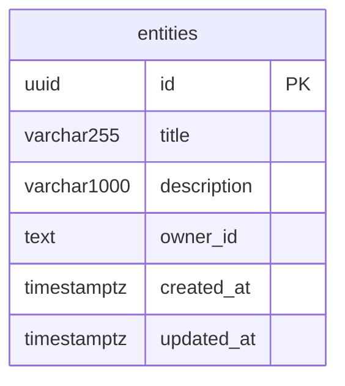

# Data Models

## Overview

This project uses a single Supabase backend (PostgreSQL) as its persistence layer. The `entities` table is the reference CRUD pattern, demonstrating how to model a resource with owner-scoped Row-Level Security. Pydantic models live in `backend/app/models/` as a package with three modules: `common.py` (shared response envelopes and error types), `auth.py` (JWT identity types), and `entity.py` (entity resource schemas). There is no ORM; persistence is handled entirely via the Supabase REST client (`supabase-py`). Database migrations are managed by the Supabase CLI in `supabase/migrations/` and applied with `supabase db push`.

**Database:** Supabase (PostgreSQL)
**Schema:** public

---

## Entity Relationship Diagram



> `owner_id` holds a Clerk user ID (text). Tenant isolation is enforced at the database level by Row-Level Security policies scoped to the JWT `sub` claim. There are no inter-table foreign key relationships in the current schema.

---

## Tables

### entities

> Managed by Supabase CLI (not Alembic). Accessed via the Supabase REST client. Row-Level Security is enabled; the service role key bypasses RLS for admin operations.

```sql
-- supabase/migrations/20260227000000_create_entities.sql

CREATE EXTENSION IF NOT EXISTS "pgcrypto";

CREATE TABLE entities (
    id          UUID            PRIMARY KEY DEFAULT gen_random_uuid(),
    title       VARCHAR(255)    NOT NULL,
    description VARCHAR(1000),
    owner_id    TEXT            NOT NULL,
    created_at  TIMESTAMPTZ     NOT NULL DEFAULT now(),
    updated_at  TIMESTAMPTZ     NOT NULL DEFAULT now()
);

CREATE INDEX idx_entities_owner_id ON entities(owner_id);

CREATE OR REPLACE FUNCTION update_updated_at()
RETURNS TRIGGER AS $$
BEGIN
    NEW.updated_at = now();
    RETURN NEW;
END;
$$ LANGUAGE plpgsql;

CREATE TRIGGER entities_updated_at
    BEFORE UPDATE ON entities
    FOR EACH ROW
    EXECUTE FUNCTION update_updated_at();

ALTER TABLE entities ENABLE ROW LEVEL SECURITY;

CREATE POLICY "Users can view own entities"
    ON entities FOR SELECT
    USING (owner_id = current_setting('request.jwt.claim.sub', true));

CREATE POLICY "Users can insert own entities"
    ON entities FOR INSERT
    WITH CHECK (owner_id = current_setting('request.jwt.claim.sub', true));

CREATE POLICY "Users can update own entities"
    ON entities FOR UPDATE
    USING (owner_id = current_setting('request.jwt.claim.sub', true))
    WITH CHECK (owner_id = current_setting('request.jwt.claim.sub', true));

CREATE POLICY "Users can delete own entities"
    ON entities FOR DELETE
    USING (owner_id = current_setting('request.jwt.claim.sub', true));
```

**Columns:**

| Column | Type | Nullable | Default | Description |
|--------|------|----------|---------|-------------|
| id | UUID | No | gen_random_uuid() | Primary key, generated by the database |
| title | VARCHAR(255) | No | — | Human-readable entity title; 1–255 characters |
| description | VARCHAR(1000) | Yes | NULL | Optional freeform description; maximum 1000 characters |
| owner_id | TEXT | No | — | Clerk user ID of the owning user; set at creation, never changed by a normal update |
| created_at | TIMESTAMPTZ | No | now() | UTC timestamp set at row insertion |
| updated_at | TIMESTAMPTZ | No | now() | UTC timestamp updated automatically by the `entities_updated_at` trigger on every UPDATE |

**Business Rules:**

1. `owner_id` is injected by the service layer from the authenticated caller's Clerk JWT `sub` claim; it is never accepted from API request bodies (`entity_service.create_entity` injects `owner_id` as a function argument).
2. All queries in `entity_service.py` filter by `owner_id` explicitly (`.eq("owner_id", owner_id)`) in addition to RLS, providing defence-in-depth for tenant isolation.
3. RLS policies on `entities` use `current_setting('request.jwt.claim.sub', true)` to resolve the caller identity from the Supabase JWT context; the anon and authenticated Supabase roles are subject to these policies.
4. Operations using the Supabase service role key bypass RLS entirely — this key must be restricted to trusted server-side contexts only.
5. `updated_at` is maintained exclusively by the `entities_updated_at` database trigger; application code must not set this column manually.
6. `list_entities` caps page size at 100 records (`_MAX_LIMIT = 100`) regardless of the `limit` argument supplied by the caller.
7. `update_entity` with an empty payload (no fields set) performs a no-op by fetching and returning the current entity without issuing an UPDATE statement.

**Constraints:**

| Name | Type | Definition |
|------|------|------------|
| entities_pkey | PRIMARY KEY | (id) |
| "Users can view own entities" | RLS POLICY (SELECT) | `owner_id = current_setting('request.jwt.claim.sub', true)` |
| "Users can insert own entities" | RLS POLICY (INSERT WITH CHECK) | `owner_id = current_setting('request.jwt.claim.sub', true)` |
| "Users can update own entities" | RLS POLICY (UPDATE) | USING and WITH CHECK: `owner_id = current_setting('request.jwt.claim.sub', true)` |
| "Users can delete own entities" | RLS POLICY (DELETE) | `owner_id = current_setting('request.jwt.claim.sub', true)` |

**Indexes:**

| Name | Columns | Type | Purpose |
|------|---------|------|---------|
| entities_pkey | id | btree (unique) | Primary key lookup |
| idx_entities_owner_id | owner_id | btree | Fast owner-scoped list and lookup queries |

---

## Relationships

There are no database-level foreign key relationships in the current schema. The `entities` table is self-contained; tenant isolation is enforced entirely through RLS policies scoped to the Clerk JWT `sub` claim stored in `owner_id`.

---

## Schema Variants (Pydantic / API Layer)

Entity models are **pure Pydantic `BaseModel` types — NOT SQLModel** and have no ORM table mapping. Persistence is handled entirely via the Supabase REST client (`supabase-py`).

| Class | Purpose |
|-------|---------|
| `EntityBase` | Shared fields: title (required, 1–255 chars), description (optional, max 1000 chars) |
| `EntityCreate` | API creation payload — inherits EntityBase; title required, description optional |
| `EntityUpdate` | API partial-update payload — does NOT inherit EntityBase; both fields optional for true PATCH semantics |
| `EntityPublic` | API response — id (UUID), title, description, owner_id (Clerk user ID), created_at, updated_at |
| `EntitiesPublic` | Paginated collection response — data[] of EntityPublic + total count |

### Entity Schema Family (`backend/app/models/entity.py`)

The inheritance chain is:

```
EntityBase
├── EntityCreate      (inherits EntityBase — title required)
└── EntityPublic      (inherits EntityBase — adds id, owner_id, created_at, updated_at)

EntityUpdate          (standalone BaseModel — all fields optional for PATCH semantics)

EntitiesPublic        (standalone BaseModel — wraps list[EntityPublic] + count)
```

`EntityUpdate` deliberately does NOT inherit `EntityBase` so that every field is independently optional, enabling true partial-update (PATCH) semantics where only supplied fields are written to the database.

---

## Shared Pydantic Models

These models live in `backend/app/models/` and are **pure Pydantic types — not database tables**. They have no corresponding migrations, no ORM mapping, and no SQL representation. They define standard contracts for auth identity and API response envelopes shared across all routes.

### Principal (`backend/app/models/auth.py`)

Represents the authenticated caller extracted from a validated Clerk JWT. Used as a FastAPI dependency injection type in route handlers — the JWT verification middleware resolves this object and injects it directly into endpoint function signatures.

```python
class Principal(BaseModel):
    user_id: str
    session_id: str
    roles: list[str] = []
    org_id: str | None = None
```

**Fields:**

| Field | Type | Required | Default | Description |
|-------|------|----------|---------|-------------|
| user_id | str | Yes | — | Clerk user ID (e.g. `user_2abc...`) extracted from the JWT `sub` claim |
| session_id | str | Yes | — | Clerk session ID extracted from the JWT `sid` claim |
| roles | list[str] | No | `[]` | List of role names granted to this user |
| org_id | str \| None | No | `None` | Clerk organisation ID, or `None` when the user has no active organisation |

**Business Rules:**

1. `user_id` is always present — it is the primary identity key for all authorization decisions in route handlers.
2. `session_id` is always present — it is the Clerk session ID from the JWT `sid` claim, used for session-level identification and revocation checks.
3. `roles` defaults to an empty list; routes requiring a specific role must check membership explicitly.
4. `org_id` is `None` for users operating outside an organisation context; multi-tenant routes must treat `None` as the personal workspace.
5. `Principal` is never instantiated from user-supplied input; it is constructed only by the JWT verification dependency.

---

### ErrorResponse (`backend/app/models/common.py`)

Standard error envelope returned for all API error responses (4xx and 5xx). Every error handler in `backend/app/core/errors.py` serializes to this shape, ensuring a consistent contract for API consumers.

```python
class ErrorResponse(BaseModel):
    error: str
    message: str
    code: str
    request_id: str
```

**Fields:**

| Field | Type | Required | Default | Description |
|-------|------|----------|---------|-------------|
| error | str | Yes | — | HTTP status category in UPPER_SNAKE_CASE (e.g. `NOT_FOUND`, `INTERNAL_ERROR`) |
| message | str | Yes | — | Human-readable error description suitable for display |
| code | str | Yes | — | Machine-readable UPPER_SNAKE_CASE error code for programmatic handling |
| request_id | str | Yes | — | UUID of the originating request for log correlation |

**Business Rules:**

1. `error` is derived from `STATUS_CODE_MAP` in `errors.py` — it reflects the HTTP status category, not the application-specific code.
2. `code` is more granular than `error`; for example `error="NOT_FOUND"` and `code="ENTITY_NOT_FOUND"` can coexist.
3. `request_id` must be a valid UUID string; it is generated per-request by the exception handler, not the caller.
4. `message` is intended for human consumption; API clients should branch on `code`, not `message`.

---

### ValidationErrorDetail (`backend/app/models/common.py`)

Represents a single field-level validation failure. Used as elements within the `details` list of `ValidationErrorResponse`. Field paths use dot notation for nested fields.

```python
class ValidationErrorDetail(BaseModel):
    field: str
    message: str
    type: str
```

**Fields:**

| Field | Type | Required | Default | Description |
|-------|------|----------|---------|-------------|
| field | str | Yes | — | Field path using dot notation for nested fields (e.g. `address.street`) |
| message | str | Yes | — | Human-readable validation message for this specific field |
| type | str | Yes | — | Error type identifier (e.g. `missing`, `string_type`, `value_error`) |

**Business Rules:**

1. `field` uses the raw field name without request-location prefixes — it must not start with `body.`, `query.`, or `path.`.
2. `type` values correspond to Pydantic v2 error type identifiers.

---

### ValidationErrorResponse (`backend/app/models/common.py`)

Extends `ErrorResponse` with a `details` list of per-field `ValidationErrorDetail` objects. Returned with HTTP 422 from the request validation exception handler.

```python
class ValidationErrorResponse(ErrorResponse):
    details: list[ValidationErrorDetail]
```

**Fields:**

Inherits all four fields from `ErrorResponse` (`error`, `message`, `code`, `request_id`) plus:

| Field | Type | Required | Default | Description |
|-------|------|----------|---------|-------------|
| details | list[ValidationErrorDetail] | Yes | — | List of individual field validation errors; may be empty for non-field errors |

**Business Rules:**

1. `error` is always `"VALIDATION_ERROR"` and `code` is always `"VALIDATION_FAILED"` for request-body validation failures handled by the FastAPI `RequestValidationError` handler.
2. `details` may be an empty list in edge cases where Pydantic provides no field-level breakdown.
3. This type is a strict superset of `ErrorResponse` — any consumer that handles `ErrorResponse` handles `ValidationErrorResponse` as well.

---

### PaginatedResponse[T] (`backend/app/models/common.py`)

Generic paginated list envelope for all list endpoints. The type parameter `T` is the item schema. `count` reflects the total across all pages, not just the current page.

```python
class PaginatedResponse[T](BaseModel):
    data: list[T]
    count: int
```

**Fields:**

| Field | Type | Required | Default | Description |
|-------|------|----------|---------|-------------|
| data | list[T] | Yes | — | Page of items; may be an empty list when no results match |
| count | int | Yes | — | Total number of items across all pages (for pagination controls) |

**Business Rules:**

1. `count` represents the total result set size, not `len(data)` — callers must not assume `count == len(data)`.
2. `data` may be an empty list when `count` is zero or when the requested page offset exceeds the total.
3. Usage: `PaginatedResponse[EntityPublic](data=entities, count=total)` — the type parameter is passed at instantiation, not class definition.

---

## Migration History

### Supabase CLI Migrations (`entities` table)

Migrations are located in `supabase/migrations/`. Applied via `supabase db push` or `supabase migration up`. Migrations are plain SQL files managed by the Supabase CLI.

| File | Date | Description | Reversible |
|------|------|-------------|------------|
| `20260227000000_create_entities.sql` | 2026-02-27 | Create `entities` table with UUID PK, owner index, `updated_at` trigger, RLS enabled, and 4 RLS policies (SELECT/INSERT/UPDATE/DELETE all scoped to JWT `sub` claim) | Manual (no down migration) |

---

## Supabase CLI Commands Reference

The `entities` table and its RLS policies are managed by Supabase CLI migrations in `supabase/migrations/`. These commands are run from the project root.

```bash
# Apply all pending Supabase migrations to the linked project
supabase db push

# Apply pending migrations in a local Supabase dev environment
supabase migration up

# Create a new timestamped migration file
supabase migration new <migration_name>

# List applied migrations
supabase migration list

# Reset the local database and re-apply all migrations
supabase db reset
```
